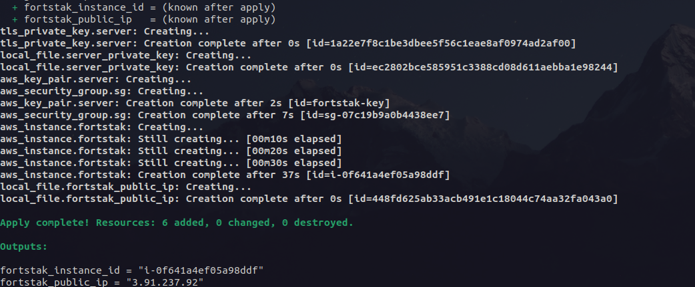
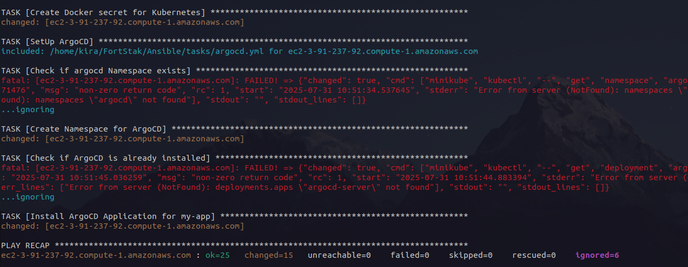
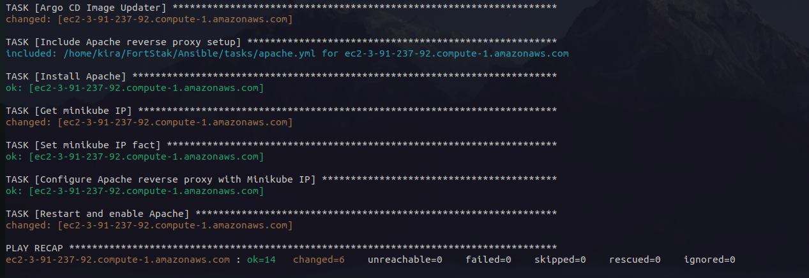
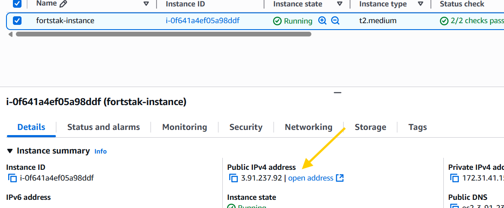
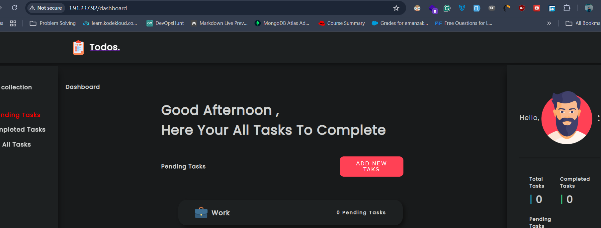
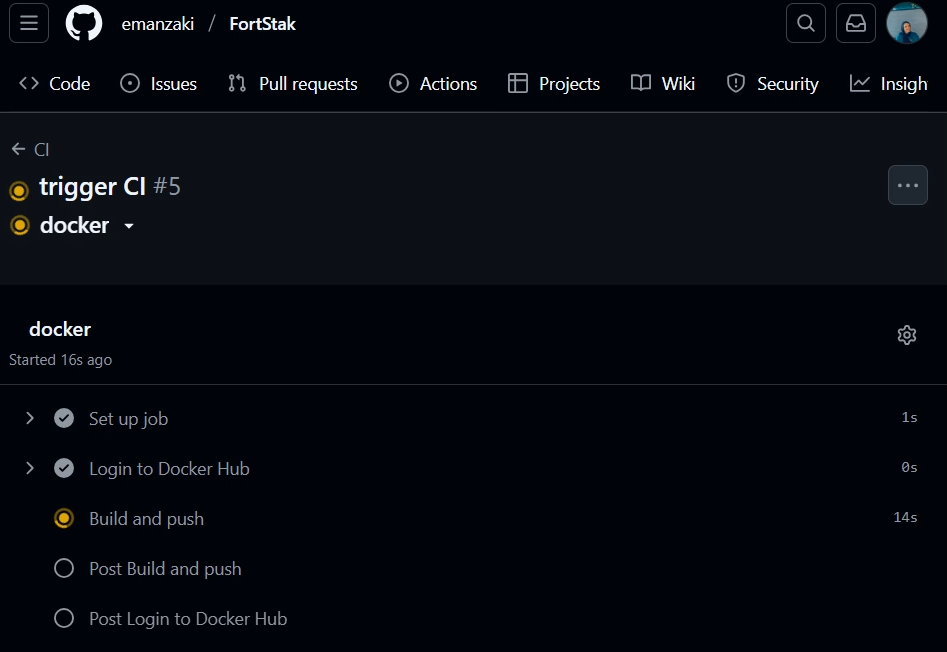
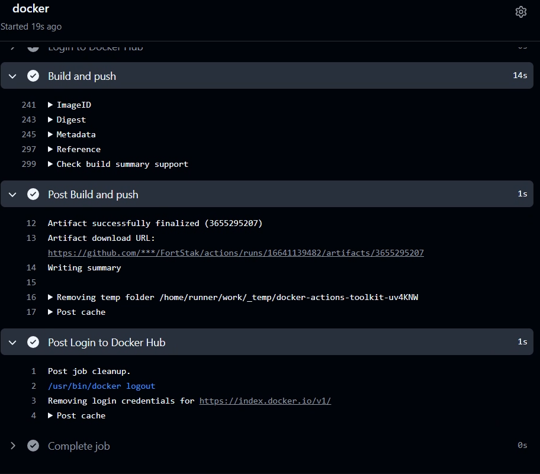
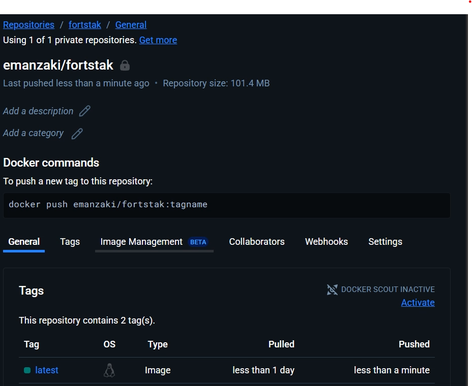
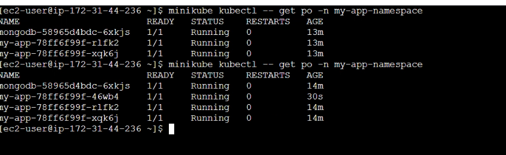

# FortStak Internship Assessment  - – Todo List Node.js App

This repository contains the completed DevOps assessment tasks based on a Node.js Todo List application. The tasks are divided into multiple parts covering containerization, CI/CD, infrastructure automation, configuration management, and Kubernetes deployment.

## 🧩 Project Structure

```bash
├── Ansible/ # Ansible playbooks and configs to automate EC2 setup
├── Dockerfile # Dockerfile to containerize the application
├── k8s/ # Kubernetes manifests and Kustomize setup
├── server-info/ # EC2 key and inventory files
├── Terraform/ # Infrastructure as Code setup for AWS resources
└── Todo-List-nodejs #our app
```

---


## ✅ Part 1 – Dockerization & CI with GitHub Actions (30 pts)

- **Cloned**: [Todo-List-nodejs](https://github.com/Ankit6098/Todo-List-nodejs)
- **Dockerized**: Created a `Dockerfile` to containerize the Node.js application.
- **GitHub Actions**: Set up a CI workflow to build and push the Docker image to Docker Hub on every push to the `main` branch. The CI will be triggered only for [Todo-List-nodejs](./Todo-List-nodejs) folder and [Dockerfile](./Dockerfile).


## ☁️ Part 2 – Infrastructure Provisioning with Terraform 

Terraform is used to provision AWS infrastructure:

- **EC2 Instances**: Provisioned EC2 instances in the public subnet.

- **Security Group**: Configured security groups to allow necessary traffic (HTTP, SSH).

- **Key Pair**: Created an EC2 key pair for SSH access.


## 🛠️ Part 3 – Configuration Management with Ansible 

- **Ansible Playbooks**: Developed Ansible playbooks to automate the installation and configuration of the application on the EC2 instances.

- **Inventory Management**: Managed Dynamic inventory to define the target host on AWS for Ansible automation.

- **Provisioning**: Used Ansible to provision the application environment, ensuring consistency across instances.

- **Application Setup**: Automated the installation and configuration of the application stack, including:

  - **Docker**: Installed Docker and configured it to run the application containers.
  - **Minikube**: Set up Minikube for local Kubernetes development.
  - **Apache**: Configured Apache to reverse proxy EC2’s port to the Minikube service port.
  - **Argo CD**: Installed and configured Argo CD for continuous deployment.

- **Argo CD Image Updater**: Installs and configures Argo CD Image Updater

- **Git and Docker Credentials**: Created secrets for Git and Docker credentials to allow Argo CD to pull images and access repositories.

## 🐳 Part 4 – Kubernetes Deployment with Kustomize

- **Kubernetes Manifests**: Created Kubernetes manifests for deploying the application.

- **Kustomize**: Used Kustomize to manage Kubernetes resources, allowing for easy customization and environment-specific configurations.

- **Argo CD Application**: Defined an Argo CD application manifest to deploy the application on the Kubernetes cluster.

## 🚀 Part 5 – Argo CD Setup

- **Argo CD Installation**: Installed Argo CD on the Kubernetes cluster.

- **Application Deployment**: Deployed the application using Argo CD, enabling GitOps workflows.

- **Image Updater**: Configured Argo CD Image Updater to automatically update application images based on the latest tags.


---

## 🛠 Tools & Technologies
- **Terraform**: AWS EC2 Provisioning

- **Ansible**: Server Configuration

- **Docker**: Containerization

- **Docker Compose**: Local container orchestration

- **GitHub Actions**: CI pipeline

- **Minikube**: Kubernetes cluster

- **Argo CD**: GitOps-based Continuous Delivery

- **Argo CD Image Updater**: Automatic image pull on change

- **Apache**: Reverse proxy to Kubernetes app

---
## 📦 How to Run
### Prerequisites
Prerequisites: AWS CLI, Terraform, Ansible, Docker.

1- **Clone the Repository**:
   ```bash
   git clone https://github.com/emanzaki/FortStak.git
   cd FortStak
   ```
2- **Provision Infrastructure**:
   ```bash
   cd Terraform
   terraform init
   terraform apply
   ```


3- **Configure Ansible**:

Update the [ansible.cfg](./Ansible/ansible.cfg) file with your configuration.

Add your secrets for docker and git credentials in the `vars` folder:

```bash
    cd Ansible
    ansible-vault create vars/docker_creds.yml
    ansible-vault create vars/git_creds.yml
```
4- **Run Ansible Playbook**:

   ```bash
   ansible-playbook server.yml --ask-vault-pass
   ```



```bash
    ansible-playbook app.yml --ask-vault-pass
```




5- **Access the Application**:
   - Open your browser and navigate to `http://<EC2_PUBLIC_IP>/` to access the Todo List application.



copy the public IP of your EC2 instance and paste it in your browser to access the application.



6- **Trigger GitHub Actions**:
   - Push changes to the Todo app directory to trigger the CI/CD pipeline.



wait for the GitHub Actions to complete the build and push the Docker image to Docker Hub.


Check the Docker Hub repository to verify the image is pushed successfully.



8- **Verify Argo CD Deployment**:
   - Change to the `k8s` directory and push the changes to your Git repository.

for example change the number of
replicas in the `application.yml` file:

```yaml
spec:
  replicas: 2
```



9- **Image Updater Configuration**:
   - Configure the Argo CD Image Updater to automatically update the application image when a new version is available.
   - Update the `kustomization.yaml` file to include the image updater annotations:

```yaml
images:
  - name: <your-image-name>
    newTag: <your-new-tag>
```
